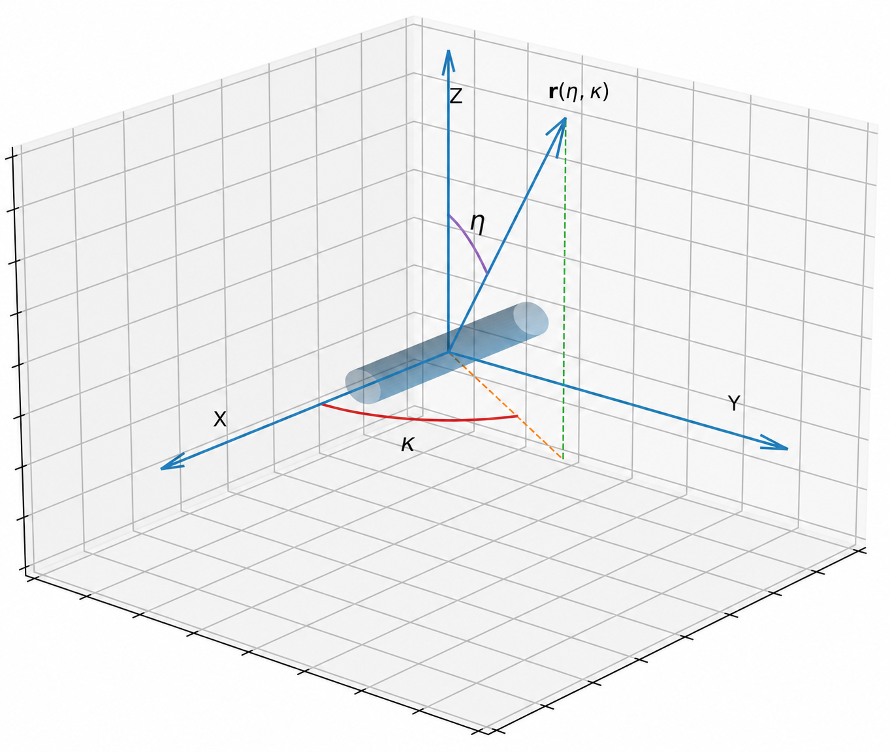
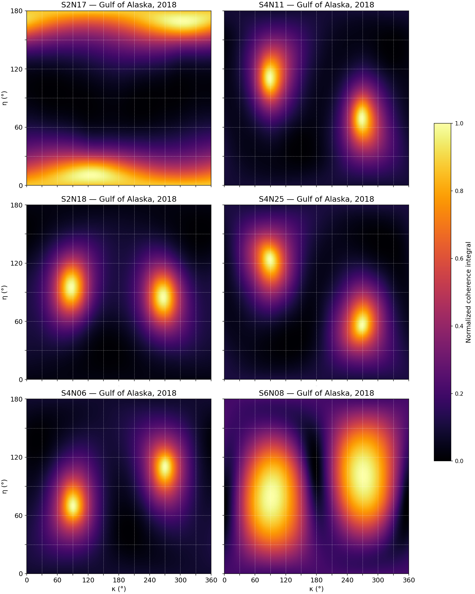

# Method for Restoring the Orientation of Ocean Bottom Seismometers Using Distant Earthquakes Records

## Annotation:
The goal of this project is to restore the orientation of ocean bottom seismometers from distant earthquake data. For each event-station pair a diagram will be produced. It is expected to show 2 major maxima, which correspond to the up and down directions. The definitions of the eta and kappa angles are shown below. 

## Definition of the angles eta and kappa. The cylinder symbolizes the body of the station, where X, Y, Z - are the seismometer's axes #


## Data:
This repository includes pressure and acceleration registration data for 4 major earthquakes, from 6 sensors in the `data` folder. The file `channels.tbl.20250303` contains a table with information about the sensors (name, coordinates, depth, etc.). The data is provided by the NIED organization: https://hinetwww11.bosai.go.jp/auth/oc/.

If you use new data not included in the `data` folder, the filenames of the raw data should match the sensor names (as listed in the `channels.tbl.20250303` file).

## Requirements:

The notebook files have been run with python 3.12.0 on Windows 10 OS with NVIDIA CUDA supported (Adapt all needed packages versions accroding your python version)

## Method execution guide:
### For all versions
Change the paths in the `eventsp` array to your own paths to the pressure recording folders, and in `eventsac` to the acceleration recording folders. In the `stations` array, you need to specify the data for the selected stations. They are given in the following order: station name, pressure sensor ID, z-component acceleration ID, station depth in meters, calibration coefficients for the accelerometer's z, x, y axes, x-component acceleration ID, y-component acceleration ID. Sensor data can be found in the `channels.tbl.20240101` file provided in the data folder, or on the official NIED website.
### The GPU implementation
Open the `GPU.ipynb` file. the current version is ready to be launched in Google Colab. 

Change `thetres` to choose the resolution of the diagram. `180` is set by default and corresponds to 1 point per 1 degree, while, for example, `90` will mean 1 point per 2 degrees. `batch_size` specifies how many points are computed in parallel. If the program crashes, try a lower number. If your CUDA allows, you can increase the value to make it work faster.

### The Nelder-Mead maxima finder
Open the `maxima_finder.ipynb` file. After launching it will find the maxima with resolution of not worse than 1 degree. The program will also output the convergence trajectories from random points purely for entertainment.

## Example of generated diagrams #


## Contacts:

To ask more questions about that project, leave any recomendations, suggestions and feedback about that project and its code be free to contact Oleg V. Ponomarev:
- Email (professional): ponomarev.ov20@physics.msu.ru
- Email (personal): bumerangxfox@gmail.com
- Telegram: https://t.me/devadevam

## Citation
If you find this implementation useful in your research, please cite the original work and this repo:
```
@article{Ponomarev2026,
  title = {Method for Restoring the Orientation of Ocean Bottom Seismometers Using Distant Earthquakes Records},
  ISSN = {1420-9136},
  url = {http://dx.doi.org/10.1007/s00024-026-03975-4},
  DOI = {10.1007/s00024-026-03975-4},
  journal = {Pure and Applied Geophysics},
  publisher = {Springer Science and Business Media LLC},
  author = {Ponomarev,  Oleg V. and Kolesov,  Sergey V. and Nosov,  Mikhail A.},
  year = {2026},
  month = Apr 
}

@misc{Seism26,
  title={Method for Restoring the Orientation of Ocean Bottom Seismometers Using Distant Earthquakes Records},
  author={Ponomarev, Oleg V.},
  year={2026},
  howpublished={\url{https://github.com/Olegg66/Seismometer_orientation}},
  note={Classical and GPU implementations of the method for orientation restoring of OBS}
}
```
